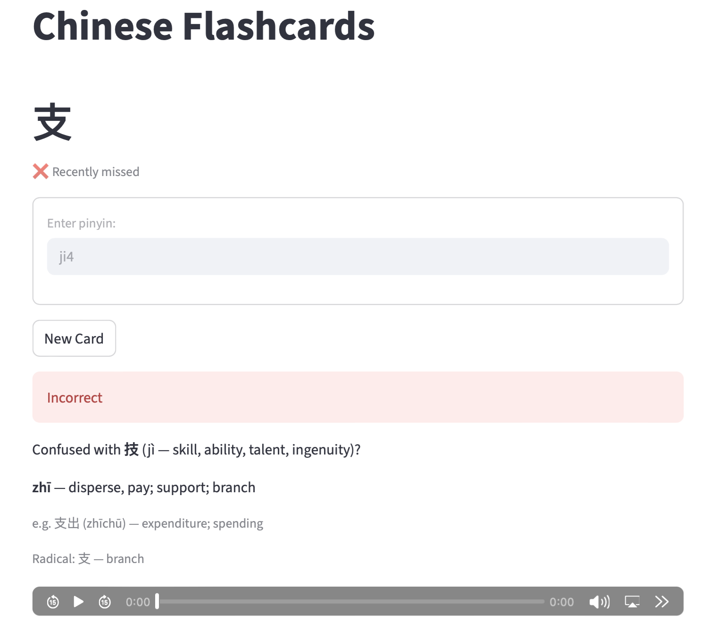

# Adaptive Mandarin Flashcards

A Mandarin learning app that adapts to how you learn, rather than treating every card the same.
https://adaptive-chinese-flashcards.streamlit.app

---

## Overview

This project demonstrates how a simple system can model learner performance and adjust review dynamically.

Instead of static flashcards, the app:
- tracks how well you know each character  
- prioritizes weak areas  
- reduces repetition for mastered content  
- provides targeted feedback based on mistakes  

The goal is to create a learning experience that feels responsive and efficient without relying on complex infrastructure.

---

## Key Features

### Adaptive Review
- Cards are shown more frequently when answered incorrectly  
- Mastered cards are deprioritized  
- Review order is driven by performance, not a fixed schedule  

---

### Mistake-Aware Feedback
- Detects when a user’s answer matches a different character  
- Surfaces likely confusion between similar characters  

---

## Design Approach

A key goal was to separate responsibilities:

- **Data layer** — trusted character, pinyin, and meaning data  
- **Adaptive logic** — tracks performance and prioritizes review  
- **Feedback layer** — highlights mistakes and confusion patterns  

This keeps the system:
- predictable  
- debuggable  
- easy to reason about  

---

## AI Exploration (and Why It Was Removed)

I initially experimented with using AI for:
- explanations  
- memory hints  
- pronunciation support  

However, this introduced accuracy issues, especially around tones and pronunciation.

Rather than forcing AI into the product, I chose to:
- remove it from core learning functionality  
- rely on deterministic logic for correctness  
- focus on adaptive behavior and clear feedback  

This resulted in a simpler and more reliable system.

---

## What I Learned

- Adaptive systems create more value than static content  
- Most of the “intelligence” comes from system design, not AI  
- AI can degrade user trust when used for factual content  
- Constraining or removing AI is sometimes the correct product decision  

---

## Future Improvements

- More sophisticated spaced repetition model  
- Better tracking of recurring confusion patterns  
- Expanded dataset of common word usage  

## Screenshots

### Main Study Screen

